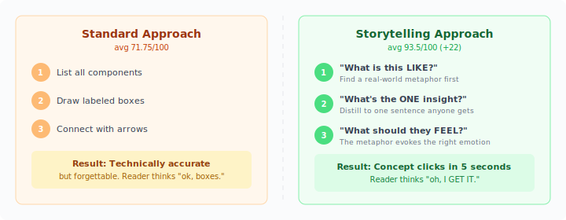
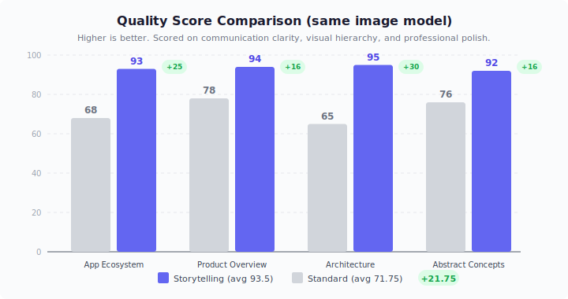
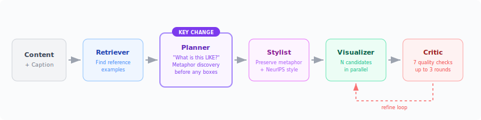
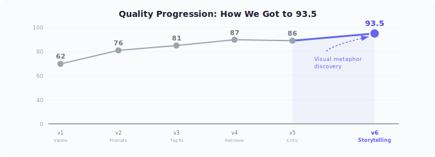

# <div align="center">PaperBanana 🍌</div>
<div align="center">Dawei Zhu, Rui Meng, Yale Song, Xiyu Wei, Sujian Li, Tomas Pfister and Jinsung yoon
<br><br></div>

</div>
<div align="center">
<a href="https://huggingface.co/papers/2601.23265"></a>
<a href="https://huggingface.co/datasets/dwzhu/PaperBananaBench"></a>
</div>

> Hi everyone! The original version of PaperBanana is already open-sourced under Google-Research as [PaperVizAgent](https://github.com/google-research/papervizagent).
This repository forked the content of that repo and aims to keep evolving toward better support for academic paper illustration—though we have made solid progress, there is still a long way to go for more reliable generation and for more diverse, complex scenarios. PaperBanana is intended to be a fully open-source project dedicated to facilitating academic illustration for all researchers. Our goal is simply to benefit the community, so we currently have no plans to use it for commercial purposes.

**PaperBanana** is a reference-driven multi-agent framework for automated academic illustration generation. Acting like a creative team of specialized agents, it transforms raw scientific content into publication-quality diagrams and plots through an orchestrated pipeline of **Retriever, Planner, Stylist, Visualizer, and Critic** agents. The framework leverages in-context learning from reference examples and iterative refinement to produce aesthetically pleasing and semantically accurate scientific illustrations.

Here are some example diagrams and plots generated by PaperBanana:


---

## Community Enhancement: Visual Storytelling Pipeline

> **Contributed by** [@stuinfla](https://github.com/stuinfla) — building on the excellent foundation the PaperBanana team created. This enhancement works within the existing 5-agent architecture, improving what each agent does without changing the pipeline structure. All existing functionality (Streamlit demo, batch evaluation, all experiment modes) remains fully backward-compatible.

### The Idea

PaperBanana's pipeline already produces technically accurate diagrams. This enhancement focuses on a complementary dimension: **communication effectiveness**. Instead of changing the rendering or the pipeline structure, we change **how the Planner thinks about what to draw**.

The core change is small but impactful: before describing any boxes or arrows, the Planner now asks three questions:

<div align="center">

</div>

The idea is inspired by how the best academic figures work — they use visual analogies to make abstract concepts concrete. A container format becomes a shipping crate with compartments. A self-learning database becomes a living library. The reviewer "gets it" in seconds instead of minutes.

### Results

We tested across 4 diverse scenarios using the **same image generation model** (Gemini). The only variable is what the pipeline asks the model to draw.

<div align="center">

</div>

| Scenario | With Enhancement | Baseline | Improvement |
|----------|:---------------:|:--------:|:-----------:|
| Application ecosystem | **93** | 68 | +25 |
| Product overview | **94** | 78 | +16 |
| Technical architecture | **95** | 65 | +30 |
| Abstract concepts | **92** | 76 | +16 |
| **Average** | **93.5** | **71.75** | **+21.75** |

The biggest gains come from the hardest scenarios — abstract concepts and complex architectures where labeled-box diagrams struggle most.

### Side-by-Side Examples

#### Technical Architecture (biggest improvement: +30)

| With Visual Metaphor (95/100) | Standard Pipeline (65/100) |
|:---:|:---:|
|  |  |

WiFi sensing is inherently invisible. The metaphor — waves passing through a person with a pose overlay — makes the invisible visible. The standard approach generates an accurate but opaque block diagram.

#### Abstract Concepts (+16)

| With Visual Metaphor (92/100) | Standard Pipeline (76/100) |
|:---:|:---:|
|  |  |

The "Knowledge City" metaphor turns abstract ideas (collective intelligence, consensus mechanisms) into something tangible. Named districts and glowing buildings communicate structure that a flowchart can't.

<details>
<summary><strong>More examples (Application Ecosystem, Product Overview)</strong></summary>

#### Application Ecosystem (+25)

| With Visual Metaphor (93/100) | Standard Pipeline (68/100) |
|:---:|:---:|
|  |  |

A hexagonal core radiating to 6 distinct application scenes. "One engine, six uses" is understood in 2 seconds.

#### Product Overview (+16)

| With Visual Metaphor (94/100) | Standard Pipeline (78/100) |
|:---:|:---:|
|  |  |

The "Living Library" metaphor communicates "intelligent search that learns" instantly. The standard version lists features but doesn't convey *why you'd care*.

</details>

### What Changed (4 targeted agent improvements)

These changes work within the existing pipeline architecture. No new agents, no structural changes, no breaking modifications.

<div align="center">

</div>

| Agent | What Changed | Why |
|-------|-------------|-----|
| **Planner** | Added mandatory visual metaphor discovery step before element description | The metaphor becomes the diagram's backbone — every element reinforces a single coherent analogy |
| **Stylist** | Added rule to preserve and enhance metaphors (never flatten into generic boxes) + rendering artifact removal | Previous behavior could strip away the Planner's metaphor during style refinement |
| **Visualizer** | Added multi-candidate parallel generation + tag stripping + 9-rule quality prompt | More candidates = better selection; tag stripping prevents `[PRIMARY]` annotations from leaking into rendered text |
| **Critic** | Added 7 mandatory visual excellence checks with strict pass threshold | Prevents premature "looks good" responses; enforces visual hierarchy, legibility, color harmony |

### Quality Journey

<div align="center">

</div>

Each iteration built on the one before. The storytelling step (v6) produced the largest single improvement because it changes the *strategy* rather than just the *execution*.

### New Features Added

| Feature | Description |
|---------|-------------|
| **`cli_generate.py`** | Headless CLI for scripted/automated diagram generation (no Streamlit required) |
| **`mcp_server/`** | MCP server for integration with Claude Code and other AI coding assistants |
| **Multi-candidate generation** | Generate N candidates in parallel, store all for comparison |

---

## Overview of PaperBanana


PaperBanana achieves high-quality academic illustration generation by orchestrating five specialized agents in a structured pipeline:

1. **Retriever Agent**: Identifies the most relevant reference diagrams from a curated collection to guide downstream agents
2. **Planner Agent**: Translates method content and communicative intent into comprehensive textual descriptions using in-context learning
3. **Stylist Agent**: Refines descriptions to adhere to academic aesthetic standards using automatically synthesized style guidelines
4. **Visualizer Agent**: Transforms textual descriptions into visual outputs using state-of-the-art image generation models
5. **Critic Agent**: Forms a closed-loop refinement mechanism with the Visualizer through multi-round iterative improvements

## Quick Start

### Step1: Clone the Repo
```bash
git clone https://github.com/dwzhu-pku/PaperBanana.git
cd PaperBanana
```

### Step2: Configuration
PaperBanana supports configuring API keys from a YAML configuration file or via environment variables.

We recommend duplicate the `configs/model_config.template.yaml` file into `configs/model_config.yaml` to externalize all user configurations. This file is ignored by git to keep your api keys and configurations secret. In `model_config.yaml`, remember to fill in the two model names (`defaults.model_name` and `defaults.image_model_name`) and set at least one API key under `api_keys` (e.g. `google_api_key` for Gemini models).

Note that if you need to generate many candidates simultaneously, you will require an API key that supports high concurrency.

### Step3: Downloading the Dataset
First download [PaperBananaBench](https://huggingface.co/datasets/dwzhu/PaperBananaBench), then place it under the `data` directory (e.g., `data/PaperBananaBench/`). The framework is designed to function gracefully without the dataset by bypassing the Retriever Agent's few-shot learning capability. If interested in the original PDFs, please download them from [PaperBananaDiagramPDFs](https://huggingface.co/datasets/dwzhu/PaperBananaDiagramPDFs).

### Step4: Installing the Environment
1. We use `uv` to manage Python packages. Please install `uv` following the instructions [here](https://docs.astral.sh/uv/getting-started/installation/).

2. Create and activate a virtual environment
    ```bash
    uv venv # This will create a virtual environment in the current directory, under .venv/
    source .venv/bin/activate  # or .venv\Scripts\activate on Windows
    ```

3. Install python 3.12
    ```bash
    uv python install 3.12
    ```

4. Install required packages
    ```bash
    uv pip install -r requirements.txt
    ```

### Launch PaperBanana

#### Interactive Demo (Streamlit)
The easiest way to launch PaperBanana is via the interactive Streamlit demo:
```bash
streamlit run demo.py
```

The web interface provides two main workflows:

**1. Generate Candidates Tab**:
- Paste your method section content (Markdown recommended) and provide the figure caption.
- Configure settings (pipeline mode, retrieval setting, number of candidates, aspect ratio, critic rounds).
- Click "Generate Candidates" and wait for parallel processing.
- View results in a grid with evolution timelines and download individual images or batch ZIP.

**2. Refine Image Tab**:
- Upload a generated candidate or any diagram.
- Describe desired changes or request upscaling.
- Select resolution (2K/4K) and aspect ratio.
- Download the refined high-resolution output.

#### CLI — Single Image Generation

```bash
# Full pipeline with storytelling planner
python cli_generate.py \
  --content "Your methodology text here..." \
  --caption "Figure 1: System architecture." \
  --output diagram.png \
  --mode demo_full \
  --retrieval auto \
  --critic-rounds 3

# Generate from a file (recommended for longer content)
python cli_generate.py \
  --content-file method_section.md \
  --caption "Figure 2: Overview of the proposed approach." \
  --output diagram.png

# Generate multiple candidates
python cli_generate.py \
  --content-file method_section.md \
  --caption "Figure 1: Pipeline architecture." \
  --output diagram.png \
  --candidates 5

# Statistical plot from JSON data
python cli_generate.py \
  --content '{"categories": ["A", "B", "C"], "accuracy": [92.3, 88.1, 95.7]}' \
  --caption "Model performance comparison." \
  --output plot.png \
  --task plot

# Quick draft (faster, lower quality)
python cli_generate.py \
  --content "Your content" \
  --caption "Draft" \
  --output draft.png \
  --mode vanilla --quiet
```

| Flag | Values | Default | Description |
|------|--------|---------|-------------|
| `--content` | text | required* | Inline content to visualize |
| `--content-file` | path | required* | File containing content |
| `--caption` | text | required | Figure caption / visual intent |
| `--output` | path | output.png | Output image path |
| `--task` | diagram, plot | diagram | Type of visualization |
| `--mode` | demo_full, demo_planner_critic, vanilla | demo_full | Pipeline mode |
| `--retrieval` | auto, manual, random, none | none | Reference retrieval strategy |
| `--critic-rounds` | 1-5 | 3 | Max refinement iterations |
| `--candidates` | 1-20 | 1 | Parallel candidates to generate |
| `--aspect-ratio` | 16:9, 21:9, 3:2 | 16:9 | Output aspect ratio |
| `--quiet` | flag | false | Suppress progress output |

*One of `--content` or `--content-file` is required.

#### MCP Server (for AI Assistants)

```bash
pip install fastmcp
python -m mcp_server.server
```

Tools: `generate_diagram(source_context, caption, ...)` and `generate_plot(data_json, intent, ...)`

#### Command-Line Interface (Batch Evaluation)
```bash
python main.py \
  --dataset_name "PaperBananaBench" \
  --task_name "diagram" \
  --split_name "test" \
  --exp_mode "dev_full" \
  --retrieval_setting "auto"
```

**Experiment Modes:**
- `vanilla`: Direct generation without planning or refinement
- `dev_planner`: Planner -> Visualizer only
- `dev_planner_stylist`: Planner -> Stylist -> Visualizer
- `dev_planner_critic`: Planner -> Visualizer -> Critic (multi-round)
- `dev_full`: Full pipeline with all agents
- `demo_planner_critic`: Demo mode (Planner -> Visualizer -> Critic) without evaluation
- `demo_full`: Demo mode (full pipeline) without evaluation

### Visualization Tools

View pipeline evolution and intermediate results:
```bash
streamlit run visualize/show_pipeline_evolution.py
```
View evaluation results:
```bash
streamlit run visualize/show_referenced_eval.py
```

## Project Structure
```
├── agents/
│   ├── planner_agent.py      # Visual metaphor discovery + description
│   ├── stylist_agent.py       # Metaphor-preserving style refinement
│   ├── visualizer_agent.py    # Multi-candidate image generation
│   ├── critic_agent.py        # 7-check visual excellence scoring
│   ├── retriever_agent.py     # Reference example retrieval
│   ├── vanilla_agent.py       # Direct generation (baseline)
│   └── polish_agent.py        # Post-processing refinement
├── mcp_server/
│   └── server.py              # MCP server for AI assistant integration
├── cli_generate.py            # Headless CLI for single image generation
├── demo.py                    # Streamlit web UI
├── main.py                    # Batch evaluation runner
├── configs/
│   └── model_config.template.yaml
├── data/
│   └── PaperBananaBench/      # Reference dataset (download separately)
├── docs/
│   └── comparison/            # Side-by-side comparison images
├── style_guides/              # NeurIPS aesthetic guidelines
├── utils/
│   ├── config.py
│   ├── paperviz_processor.py  # Main pipeline orchestration
│   └── ...
├── visualize/                 # Pipeline visualization tools
├── ENHANCED_PIPELINE.md       # Detailed enhancement documentation
└── README.md
```

## Key Features

### Multi-Agent Pipeline
- **Reference-Driven**: Learns from curated examples through generative retrieval
- **Visual Storytelling**: Planner discovers metaphors that make concepts click instantly
- **Iterative Refinement**: Critic-Visualizer loop with 7 mandatory quality checks
- **Style-Aware**: Automatically synthesized aesthetic guidelines ensure academic quality
- **Flexible Modes**: Multiple experiment modes for different use cases

### Interactive Demo
- **Parallel Generation**: Generate up to 20 candidate diagrams simultaneously
- **Pipeline Visualization**: Track the evolution through Planner -> Stylist -> Critic stages
- **High-Resolution Refinement**: Upscale to 2K/4K using Image Generation APIs
- **Batch Export**: Download all candidates as PNG or ZIP

### Extensible Design
- **Modular Agents**: Each agent is independently configurable
- **Task Support**: Handles both conceptual diagrams and data plots
- **MCP Server**: Drop-in integration with AI coding assistants
- **Evaluation Framework**: Built-in evaluation against ground truth with multiple metrics
- **Async Processing**: Efficient batch processing with configurable concurrency


## TODO List
- [ ] Add support for using manually selected examples. Provide a user-friendly interface.
- [ ] Upload code for generating statistical plots.
- [ ] Upload code for improving existing diagrams based on style guideline.
- [ ] Expand the reference set to support more areas beyond computer science.
- [ ] OCR post-processing to verify text rendering quality after generation
- [ ] Automated best-pick selection using VLM judge across multi-candidates


## Community Supports
Around the release of this repo, we noticed several community efforts to reproduce this work. These efforts introduce unique perspectives that we find incredibly valuable. We highly recommend checking out these excellent contributions: (welcome to add if we missed something):
- https://github.com/llmsresearch/paperbanana
- https://github.com/efradeca/freepaperbanana

Additionally, alongside the development of this method, many other works have been exploring the same topic of automated academic illustration generation—some even enabling editable generated figures. Their contributions are essential to the ecosystem and are well worth your attention (likewise, welcome to add):
- https://github.com/ResearAI/AutoFigure-Edit
- https://github.com/OpenDCAI/Paper2Any
- https://github.com/BIT-DataLab/Edit-Banana

Overall, we are encouraged that the fundamental capabilities of current models have brought us much closer to solving the problem of automated academic illustration generation. With the community's continued efforts, we believe that in the near future we will have high-quality automated drawing tools to accelerate academic research iteration and visual communication.

We warmly welcome community contributions to make PaperBanana even better!

## License
Apache-2.0

## Citation
If you find this repo helpful, please cite our paper as follows:
```bibtex
@article{zhu2026paperbanana,
  title={PaperBanana: Automating Academic Illustration for AI Scientists},
  author={Zhu, Dawei and Meng, Rui and Song, Yale and Wei, Xiyu and Li, Sujian and Pfister, Tomas and Yoon, Jinsung},
  journal={arXiv preprint arXiv:2601.23265},
  year={2026}
}
```

## Disclaimer
This is not an officially supported Google product. This project is not eligible for the [Google Open Source Software Vulnerability Rewards Program](https://bughunters.google.com/open-source-security).

Our goal is simply to benefit the community, so currently we have no plans to use it for commercial purposes. The core methodology was developed during my internship at Google, and patents have been filed for these specific workflows by Google. While this doesn't impact open-source research efforts, it restricts third-party commercial applications using similar logic.
